# Lab 1 - Setup Dev Environment

**Welcome to the first lab. In this lab you are going to setup a development environment. We start with the deployment of a development container in a Azure Container Instance. Then we setup connect Visual Studio code for remote development and finally we make sure we have the latest updates for all the tooling.**

> Make sure you have a working Azure Subscription before starting this lab or redeem an Azure Pass on [microsoftazurepass.com](https://www.microsoftazurepass.com)

## Deploy a Development Container to Azure

1. Click the "Deploy to Azure" button below\
   
2. Sign in with your Azure account that has access to the subscription you want to use
3. You should see the screen below

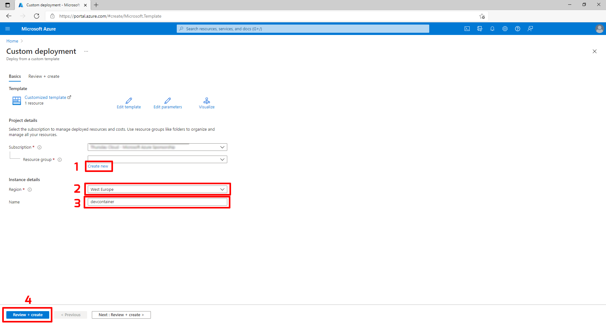

1. Click "create new" to create a new resource group.&#x20;
   1. Enter a name for the resource group in the name field like: "devcontainer\_RG"
   2. Click "OK"
2. Select the region closest to you from the dropdown
3. Name, you can change the name or leave it as is.
4. Click "Review + create"

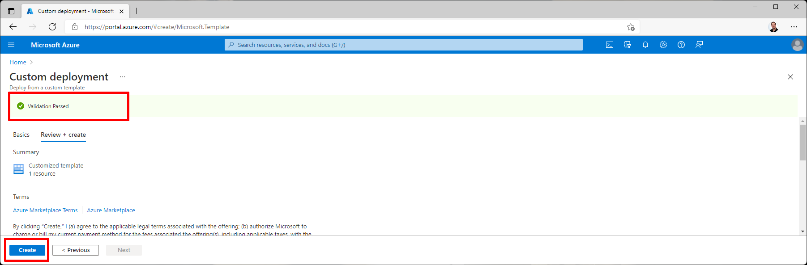

1. If all is well you should see "Validation Passed" in green
2. Click "Create" to start creating the resources. _(This can take 1-5 minutes)_

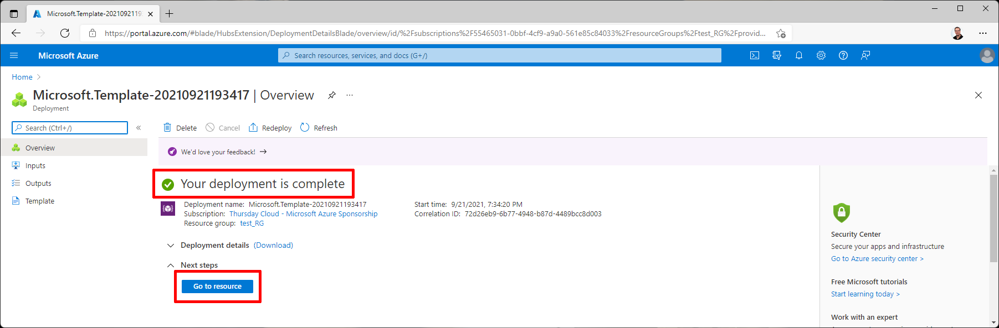

1. After a few minutes you should see "Your deployment is complete"
2. Click on the button: "Go to resource" this will bring you to the newly created DevContainer resources

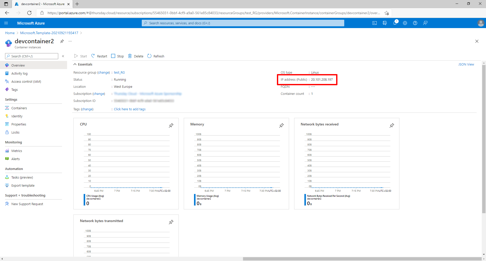

The "Go to resource" button will bring you the screen above. Copy the IP address, you need this address later on.

## Setup Visual Studio Code to use the Development Container

> Don't have Visual Studio code installed on your machine, download [Visual Studio Code here](https://code.visualstudio.com)!&#x20;
> 
> This workshop only works with the stable version, not with Insiders.

### Install the Remote SSH extension

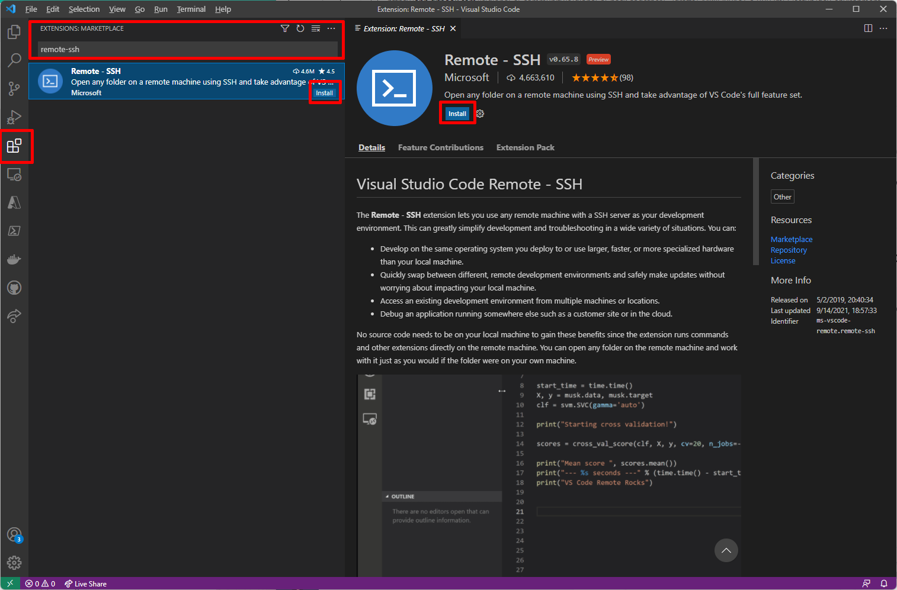

1. Open Visual Studio Code
2. Click on the extensions icon on the left (crtl-shift-x)
3. In the search bar search for:  remote-ssh
4. Click Install

### Connect to the Remote Dev Container

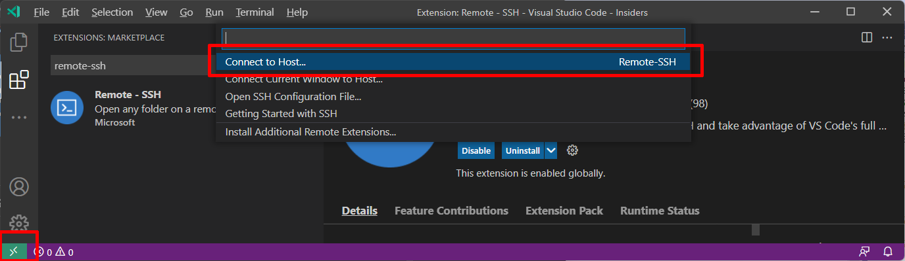

1. Click the green >< button in the bottom left corner
2. Select "Connect to Host"

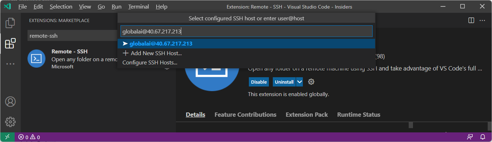

1. Enter user@host in the field. Replace user with: globalai and host with the IP address from your deployment in the previous step.
2. Press enter
3. A new VSCode window will open.
4. A Windows Security alert might pop-up, if it does click: "Allow access"

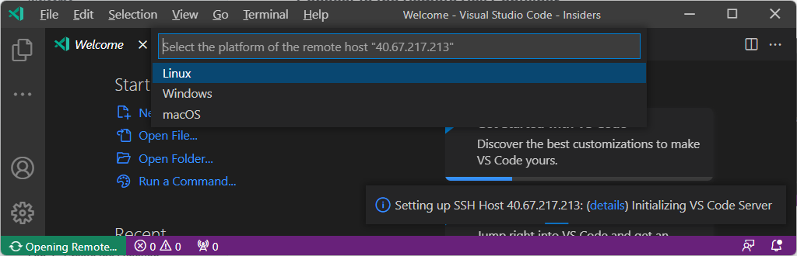

Select: Linux

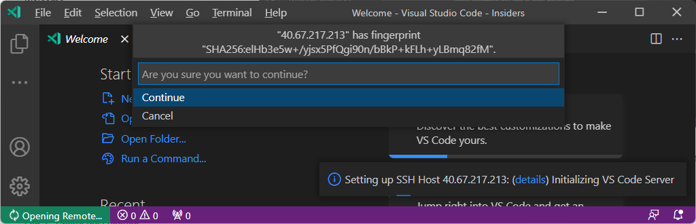

Select: Continue

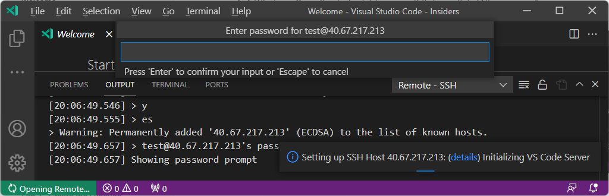

Enter the password: back2gether

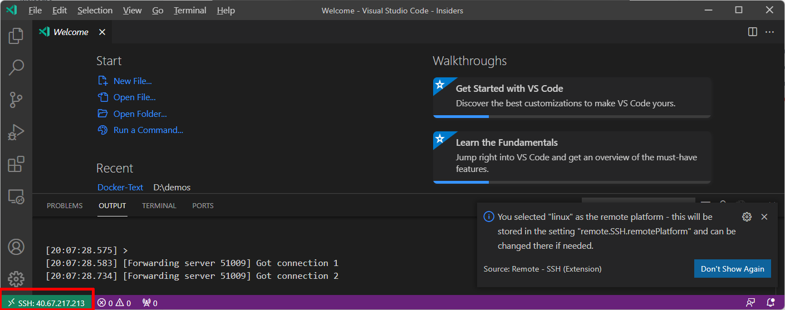

You are now connected to your Remote Dev Container!

### Final configuration

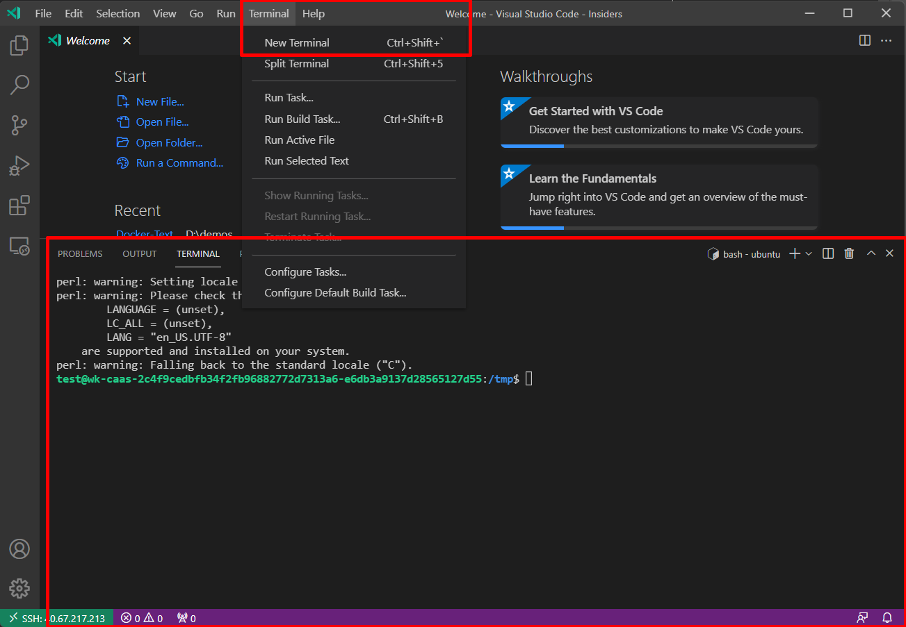

1. Open a Terminal, you can do this using the Top menu > Terminal > New Terminal
2. The terminal appears at the bottom of VSCode

#### Install additional extensions

1. Click the extensions icon on the left
2. Search for: ms-toolsai.jupyter
3. Click install
4. Search for: ms-python.python
5. Click install
6. Search for: REST Client
7. Click install

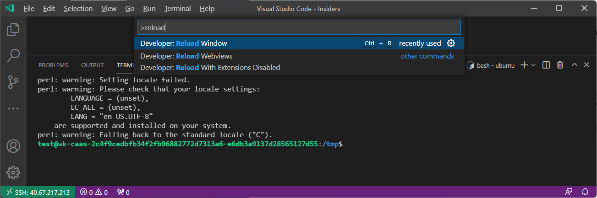

1. To activate the extensions you need to reload VSCode
2. In the Top Menu click "View" > Command Palette (crtl-shift-p)
3. Type: "reload"
4. Select: "Developer Reload Window"
5. VSCode will reload
6. It will ask for the password again, enter the password: back2gether

#### In the terminal use the Azure CLI to login into you Azure account

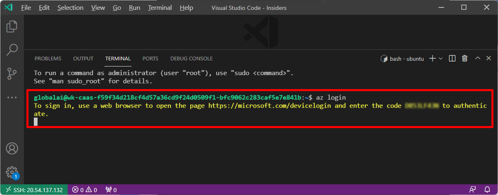

1. In the terminal type "az login --use-device-code"
2. Open a browser window and navigate to: [https://microsoft.com/devicelogin](https://microsoft.com/devicelogin)
3. Enter the code displayed in the terminal
4. Sign in with your Microsoft Account that has access to the subscription you want to use.
5. Click continue to confirm you are signing in using the Azure CLI
6. You can close the browser window.
7. In the terminal you should see a long JSON document with all the Azure Subscriptions your user account has access to.

#### Set the right subscription as default subscription

1. In the terminal type: "az account list --output table"
2. You should see a list of all the subscriptions your account has access to.
3. To set the default subscription type in the terminal:\
   "az account set -s \<SubscriptionId>"\
   Replace SubscriptionId with the subscriptionid you want to use.
4. Now this subscription will be used to create your Azure Resources by default

#### Update to the lastest versions
1.  In the terminal type: " az upgrade"

> You are now ready to start developing using Visual Studio Code and a Remote Dev Container

## &#x20;Checklist

In this lab you have completed these tasks:

* [ ] Deployed a DevContainer in an Azure Container Instance
* [ ] Connected your local Visual Studio to the DevContainer
* [ ] Installed some additional extensions in Visual Studio Code
* [ ] Connected to your Azure account using the CLI in your DevContainer
* [ ] Set the default Azure Subscription&#x20;
